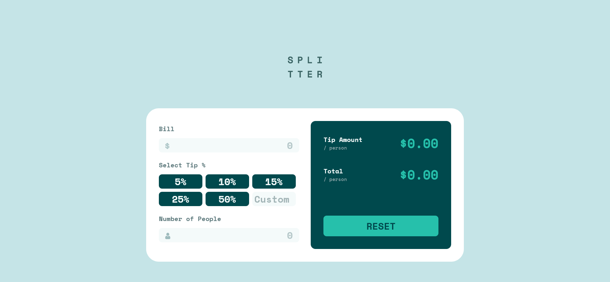
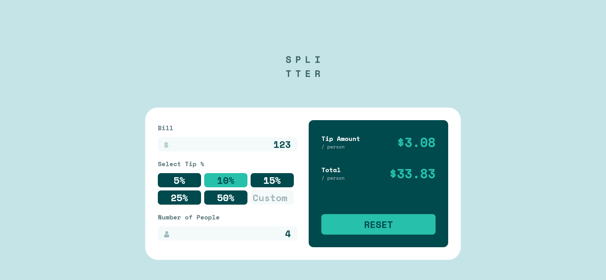

# Tip calculator app

This is a solution to the [Tip calculator app challenge on Frontend Mentor](https://www.frontendmentor.io/challenges/tip-calculator-app-ugJNGbJUX).

## Table of contents

- [Overview](#overview)
  - [The challenge](#the-challenge)
  - [Screenshot](#screenshot)
  - [Links](#links)
- [My process](#my-process)
  - [Built with](#built-with)
  - [What I learned](#what-i-learned)
  - [Continued development](#continued-development)
  - [Useful resources](#useful-resources)
- [Author](#author)
- [Acknowledgments](#acknowledgments)

## Overview

### The challenge

Users should be able to:

- View the optimal layout for the app depending on their device's screen size
- See hover states for all interactive elements on the page
- Calculate the correct tip and total cost of the bill per person

### Screenshot

Desktop empty version



Calculated version



[Mobile version](screenshots/mobile-empty.png)

### Links

- Solution URL: [Tip calculator GitHub](https://github.com/EugeneZanevskij/Tip-calculator)
- Live Site URL: [Tip calculator Live version](https://eugenezanevskij.github.io/Tip-calculator/)

## My process

### Built with

- Semantic HTML5 markup
- CSS custom properties
- Flexbox
- CSS Grid
- Desktop-first workflow
- Form use

### What I learned

Use this section to recap over some of your major learnings while working through this project. Writing these out and providing code samples of areas you want to highlight is a great way to reinforce your own knowledge.

To see how you can add code snippets, see below:

When clicking on button we can prevent form from submitting 2 ways:

```html
<button type="button"></button>
```
```js
event.preventDefault();
```
We can reset form using this:

```js
document.getElementById("form").reset();
```


### Continued development

In future projects I want to continue focusing on working with some kind of forms, inputs. 

### Useful resources

- [StackOverflow](https://stackoverflow.com/) - This helped me to overcome problem with submitting form, how to round the number to the nearest tenth.
- [MDN](https://developer.mozilla.org/en-US/) - Documentation.

## Author

- LinkedIn - [Eugene Zanevskij](https://www.linkedin.com/in/eugene-zanevskij/)
- Frontend Mentor - [@EugeneZanevskij](https://www.frontendmentor.io/profile/EugeneZanevskij)